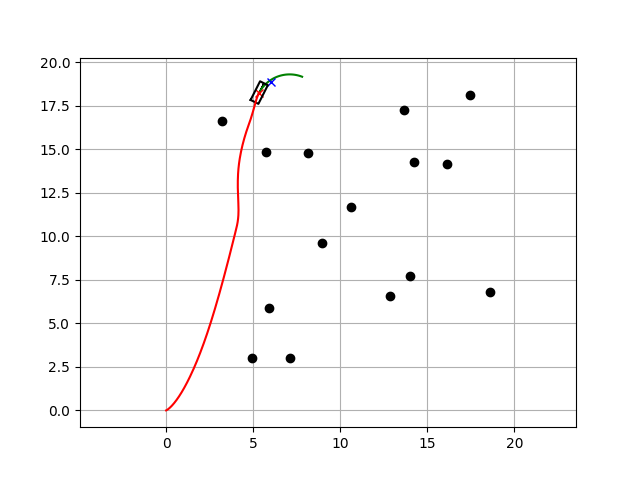

# Dynamic Window Approach (DWA) - Local Path Planning in Python

This project implements the **Dynamic Window Approach (DWA)** for local motion planning in autonomous mobile robots. Each simulation run creates a new set of random obstacles and a goal position, allowing the robot to dynamically plan its path and avoid collisions in real time.



---

##  Overview

**DWA** is a velocity-based local planner widely used in robot navigation. It works by:
- Sampling possible linear and angular velocities within the robot's dynamic limits
- Simulating future trajectories for each velocity pair
- Scoring each trajectory based on:
  - Goal proximity
  - Obstacle clearance
  - Speed and heading
- Selecting the best command to move the robot closer to the goal while avoiding obstacles

---

## Features

- Randomized goal and obstacle placement on each run
- Real-time trajectory prediction and replanning
- Collision detection and avoidance
- Support for different robot shapes (circle or rectangle)
- Clear visualization using `matplotlib`

---

## 🖥️ How to Run

### Requirements
- Python 3.x
- numpy
- matplotlib

Install dependencies:
```bash
pip install numpy matplotlib
```

# What is DWA?
The Dynamic Window Approach is a real-time local motion planner. It evaluates short-term velocity-based trajectories, making it ideal for dynamic environments where global maps are incomplete or unavailable.

It is commonly used in:

- Mobile robotics

- Self-driving cars

- SLAM and reactive navigation systems

# References
https://atsushisakai.github.io/PythonRobotics/index.html
